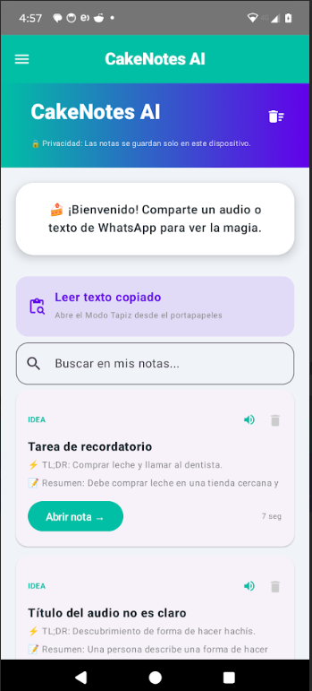
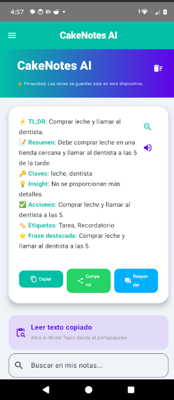
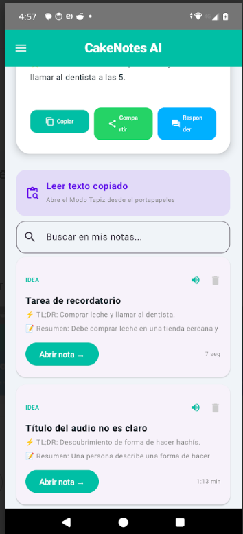
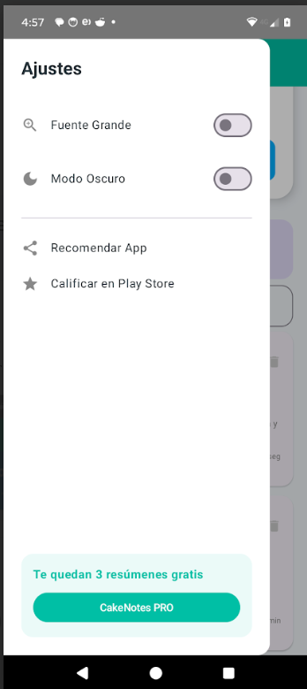

# Android App Portfolio

Desarrollador Android autodidacta con experiencia práctica creando y publicando aplicaciones móviles en Google Play.

---

## 🚀 Tecnologías

- Kotlin
- Android Studio
- Firebase
- SQLite
- APIs REST
- Material Design
- Integración IA

---
## 📱 Aplicaciones desarrolladas

### Audio Summary for WhatsApp

Aplicación Android enfocada en resumir mensajes de audio utilizando inteligencia artificial.

**Tecnologías utilizadas:**
- Kotlin
- APIs IA
- Procesamiento de texto
- Android Storage
- Material Design
  #### Screenshots

---

### Remove Metadata from Photos

Herramienta de privacidad enfocada en eliminar metadatos EXIF de imágenes antes de compartirlas.

**Tecnologías utilizadas:**
- Kotlin
- Procesamiento de imágenes
- Android File System
- Gestión de permisos Android

---

### Food Scanner: Calorie Counter

Aplicación móvil orientada al análisis y control nutricional mediante escaneo y procesamiento de información alimentaria.

**Tecnologías utilizadas:**
- Kotlin
- APIs REST
- UI Android moderna
- Procesamiento de datos

---

### Anti Theft Phone Security Zap

Aplicación de seguridad móvil enfocada en protección antirrobo y monitoreo del dispositivo.

**Tecnologías utilizadas:**
- Kotlin
- Servicios Android
- Gestión de permisos
- Seguridad móvil
- Notificaciones

## 🛠 Experiencia

- Publicación de aplicaciones en Google Play
- Desarrollo completo de apps Android
- Testing y mantenimiento de aplicaciones móviles
- Integración de APIs y funcionalidades IA
- Optimización y resolución de errores en producción

---

## 📌 Objetivo

Continuar desarrollando soluciones móviles modernas enfocadas en productividad, automatización e inteligencia artificial.
